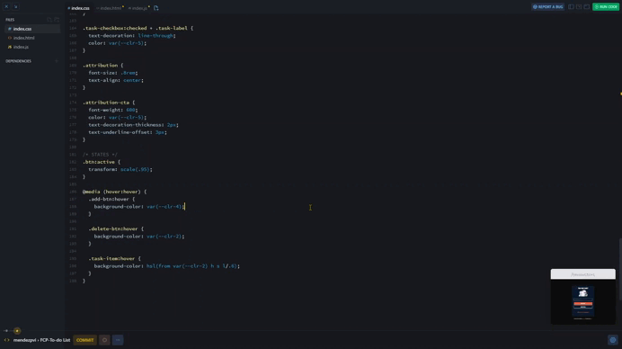

# To-do List

## *Overview* 🧐

This project is an interactive To-do List application that builds upon a previous **Chrome extension** project. The development process was inspired by the logic and structure of the *Chrome extension* but adapted to work as a standalone web application using **Firebase Realtime Database**. The app allows users to add, list, and delete tasks in real time, with the changes automatically reflected without needing to reload the page. By leveraging Firebase’s features like onValue, push, and remove, the data is stored and synchronized efficiently. Additionally, modern CSS techniques such as CSS variables and the HSL color model are employed to create a clean and accessible user interface. The result is a dynamic, responsive to-do list that enhances user experience by providing real-time task managemen

## *Pseudocode* 🖥️

1. Initialize Firebase App.

1. Capture DOM elements.

1. Listen for changes in the database.

1. Add new tasks to Firebase.

1. Render tasks in the DOM.

1. Clear the input after adding a task.

1. Remove all tasks from Firebase.

1. Show a message if no tasks are available.

## *Screenshots* 📷

## *Links* 🔗

[Scrim code](https://v2.scrimba.com/s0uo04ro2j) 👈

[Live site](https://mendezpvi.github.io/fcp-todo-list/) 👈

## *What I learned* 🤓

📌 **JavaScript:** Importing modules `import`.

📌 **Firebase:** Initializing the app with `initializeApp`, connecting to the database with `getDatabase`, creating references with `ref`, and handling data with `push`, `onValue`, `snapshot.exists()`, and `remove`.

📌 **DOM Manipulation:** Capturing input values, rendering lists dynamically, and handling events such as `submit` and `reset`.

📌 **Object Methods:** Working with objects using `Object.values`, `Object.keys`, and `Object.entries` to handle and manipulate data structures.

📌 **CSS:** Using HSL color functions and CSS variables.

📌 **Viewport:** Setting the viewport for responsive design.

📌 **Favicon:** Adding a favicon to the project for better visual representation in browser tabs.

📌 **Web Application Manifest:** Implementing a web app manifest for mobile-friendly experience and installable web apps.

## *Resources* 🗃️

🗃️ [Frontend Career Path](https://v2.scrimba.com/the-frontend-developer-career-path-c0j) by Scrimba

📺 [Relative colors make so many things easier!](https://www.youtube.com/watch?v=gPacarD9NuA) by Kevin Powell

## *Author* 🔰

✨ Frontend Mentor - [@medezpvi](https://www.frontendmentor.io/profile/mendezpvi)

✨ X (formerly Twitter) - [@medezpvi](https://x.com/mendezpvi)